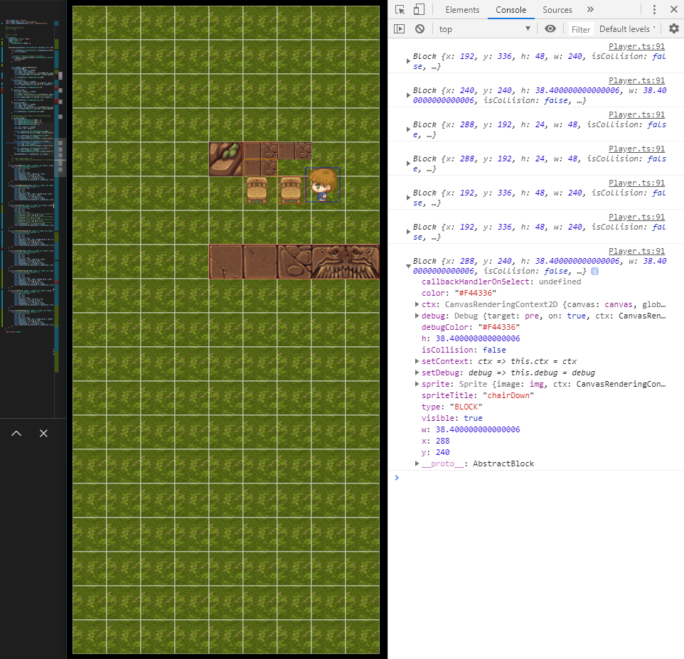

# MOTOR de Juego 2D sencillo en Vanilla JS

Juego RPG en desarrollo
El motor esta programado desde 0, no se utilizaron framwork
todo el despliegue se realiza dentro de un canvas
escrito en TypeScript
este proyecto utiliza React solo para utilizar el reload server, por lo tanto el juego esta escrito integramente en JS vanilla (TS en realidad

## Teclado
- teclado de dirección para moverce
- tecla `space` para interactuar con bloques
- tecla `m` para mostrar menu

## TODOS

- agregar bloques de puerta en items
- agregar acciones contextuales segun item
- agregar mochila con acciones

## v0.0.6

- ya es posible animar bloques, ver ejemplo de cofre
- ya es posible agregar un item dentro de un bloque
- se refactorizo el codigo simplificando
- eliminado metodos no utilizados
- eliminadas variable
- se privatizaron atributos
- se agrego listado de items en clase `Game`

## v0.0.6

- hitbox ahora retorna los item adyacentes que el player mire con tecla `space`
- finalmente agregado el menu
- ya se pueden recoger items
- item ahora pueden tener title y description
- se agrego la clase Book que contiene los items del player
- los items son Block, solo que estan dentro del Book
- la mochila ahora es un Book

## v0.0.5

- modo debug agregado
- hitbox ahora retorna los item adyacentes que el player mire con tecla `m`

## v0.0.4

- Motor de colisiones HitBox
- permite bloques de diferentes medidas

- se quito capa de items, requiere refactorizacion
- se quito mochila requiere refactor
- se quito modo debug, requiere refactor
- se rehizo por completo Colisiones

## v0.0.3
- agregado items en capa items
- agregada mochila como menu de acciones
- mejorado el codigo
- agregado sistema de sprites para imagenes
- agregado modo debug

- Primera version de menu

## v0.0.2 

- Ahora el sprite del personaje esta bien animado
- Ahora las colisiones responden ok
- Se agrego un debug mode para ver las colisiones en tiempo real
- Mejora en sprite gracias a https://opengameart.org

- personaje: https://opengameart.org/content/alternate-lpc-character-sprites-george

## v0.0.1
